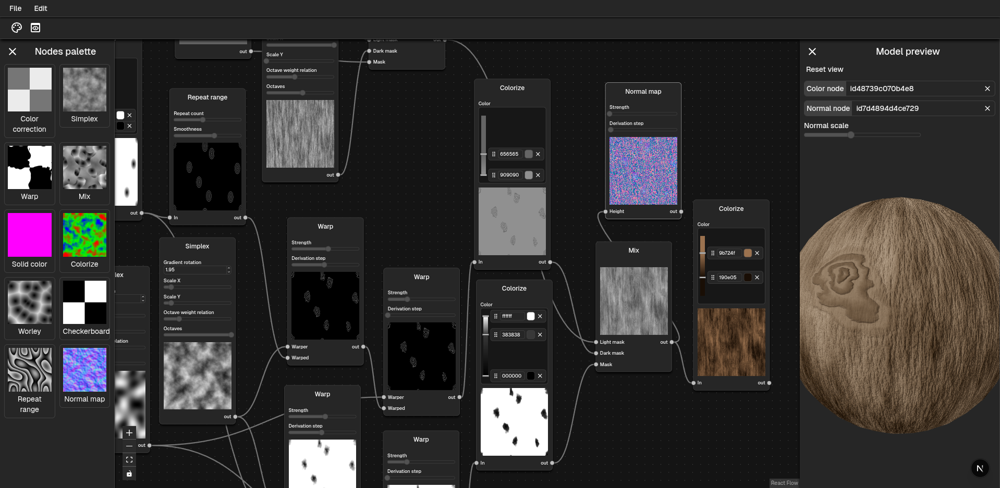

# Texture generator

<https://camilomdeoca.github.io/nextjs-webgl-texture-generator/>

This texture generator combines multiple noise functions and filters to produce
a GLSL ES shader that renders the texture procedurally. Using a shader makes
image generation faster than doing it in the CPU and allows the shader to be
used in another shader in place of a texture.

